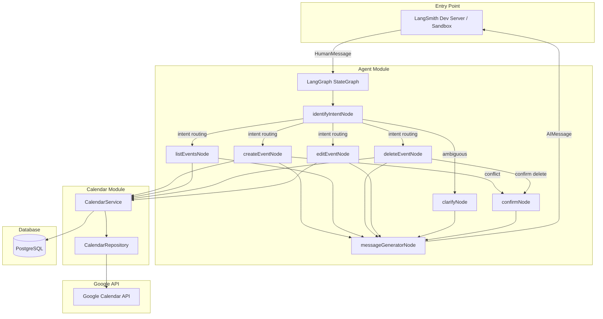

# Google Calendar Assistant — Design

**Spec**: `.specs/features/google-calendar-assistant/spec.md`
**Status**: Draft

---

## Architecture Overview

Arquitetura em 3 camadas com um módulo de agente LangGraph que orquestra a lógica conversacional e delega operações de calendário para o módulo de integração Google Calendar.



---

## Code Reuse Analysis

### Patterns do caximbo/api a Aplicar

| Pattern | Origem | Como usar |
|---------|--------|-----------|
| 3 camadas (presentation/domain/infra) | Todos os módulos | Estrutura de cada módulo NestJS |
| Result/Either pattern | `shared/lib/core/result` | Retorno de services — sem throw direto |
| BaseModel com factory methods | `shared/lib/core/model` | Base para domain models |
| PrismaRepository base class | `shared/module/prisma` | Base para repositórios |
| PrismaModule (service + lifecycle) | `shared/module/prisma` | Módulo compartilhado de DB |
| ConfigModule com factory | `shared/module/config` | Centralizar env vars |
| DTOs com class-validator | Todos os controllers | Validação de input |
| Custom exceptions hierarchy | `shared/lib/core/exception` | Error handling consistente |
| Public API facade por módulo | `*Api` services | Inter-module communication |

### Patterns do medical-appointment a Aplicar

| Pattern | Origem | Como usar |
|---------|--------|-----------|
| StateGraph com Annotation tipado | `graph/graph.ts` | Definir estado do agente |
| Node factory functions | `graph/nodes/*.ts` | Cada nó recebe services via factory |
| Prompts externalizados com Zod | `prompts/v1/*.ts` | Schema + system prompt + user prompt por nó |
| Structured output validation | Todos os nós | LLM retorna dados validados por Zod |
| Conditional routing por intent | `graph/graph.ts` | Router após identifyIntent |

### Integration Points

| System | Método de integração |
|--------|---------------------|
| Google Calendar API | `googleapis` SDK — OAuth2 com service account/token estático |
| PostgreSQL | Prisma ORM — armazenar config de calendários e logs |
| LangSmith | Env vars (`LANGSMITH_TRACING`, `LANGSMITH_API_KEY`) + `npx @langchain/langgraph-cli dev` |
| OpenRouter | `@langchain/openai` com `ChatOpenAI({ baseURL })` |

---

## Components

### Shared Module: Config

- **Purpose**: Centralizar variáveis de ambiente e configurações
- **Location**: `src/shared/module/config/`
- **Interfaces**:
  - `config.googleCalendar` — `{ clientId, clientSecret, refreshToken, defaultCalendarId }`
  - `config.llm` — `{ apiKey, baseUrl, model }`
  - `config.langsmith` — `{ apiKey, project, tracing }`
  - `config.defaults` — `{ defaultDurationMinutes: 30, defaultCalendar: "Work", language: "pt-BR" }`
- **Reuses**: Padrão ConfigModule do caximbo/api

### Shared Module: Prisma

- **Purpose**: Acesso ao banco de dados PostgreSQL
- **Location**: `src/shared/module/prisma/`
- **Interfaces**:
  - `PrismaService` extends `PrismaClient` com `onModuleInit`/`onModuleDestroy`
- **Reuses**: Padrão PrismaModule do caximbo/api

### Calendar Module

- **Purpose**: Abstração sobre a Google Calendar API — todas as operações CRUD de eventos
- **Location**: `src/calendar/`
- **Structure**:
  ```
  calendar/
  ├── domain/
  │   ├── models/
  │   │   └── calendar-event.model.ts
  │   ├── services/
  │   │   └── calendar.service.ts
  │   └── interfaces/
  │       └── calendar-repository.interface.ts
  ├── infra/
  │   ├── repositories/
  │   │   └── google-calendar.repository.ts
  │   └── providers/
  │       └── google-auth.provider.ts
  ├── presentation/
  │   └── dto/
  │       ├── create-event.dto.ts
  │       ├── update-event.dto.ts
  │       └── list-events.dto.ts
  └── public/
      └── calendar.api.ts
  ```

#### CalendarService

- **Purpose**: Lógica de negócio para operações de calendário
- **Location**: `src/calendar/domain/services/calendar.service.ts`
- **Interfaces**:
  - `createEvent(params: CreateEventParams): Promise<Result<CalendarEvent, AppException>>`
  - `listEvents(params: ListEventsParams): Promise<Result<CalendarEvent[], AppException>>`
  - `updateEvent(eventId: string, params: UpdateEventParams): Promise<Result<CalendarEvent, AppException>>`
  - `deleteEvent(eventId: string, calendarId?: string): Promise<Result<void, AppException>>`
  - `checkAvailability(dateTime: Date, durationMinutes: number, calendarId?: string): Promise<Result<boolean, AppException>>`
  - `findFreeSlots(weekStart: Date, durationMinutes: number, calendarId?: string): Promise<Result<TimeSlot[], AppException>>`
  - `listCalendars(): Promise<Result<CalendarInfo[], AppException>>`
  - `findEventsByQuery(query: string, calendarId?: string): Promise<Result<CalendarEvent[], AppException>>`
- **Dependencies**: `GoogleCalendarRepository`, `ConfigService`
- **Reuses**: Result/Either pattern do caximbo/api

#### GoogleCalendarRepository

- **Purpose**: Comunicação direta com a Google Calendar API via googleapis SDK
- **Location**: `src/calendar/infra/repositories/google-calendar.repository.ts`
- **Interfaces**:
  - `insert(calendarId: string, event: calendar_v3.Schema$Event): Promise<calendar_v3.Schema$Event>`
  - `list(calendarId: string, params: ListParams): Promise<calendar_v3.Schema$Event[]>`
  - `patch(calendarId: string, eventId: string, event: Partial<calendar_v3.Schema$Event>): Promise<calendar_v3.Schema$Event>`
  - `delete(calendarId: string, eventId: string): Promise<void>`
  - `freeBusy(params: FreeBusyParams): Promise<FreeBusyResponse>`
  - `calendarList(): Promise<calendar_v3.Schema$CalendarListEntry[]>`
- **Dependencies**: `GoogleAuthProvider`

#### GoogleAuthProvider

- **Purpose**: Gerenciar autenticação OAuth2 com o Google (token estático na v1, refresh automático)
- **Location**: `src/calendar/infra/providers/google-auth.provider.ts`
- **Interfaces**:
  - `getAuthClient(): OAuth2Client`
  - `refreshToken(): Promise<void>`
- **Dependencies**: `ConfigService`

#### CalendarApi (Public Facade)

- **Purpose**: API pública do módulo Calendar para uso pelo módulo Agent
- **Location**: `src/calendar/public/calendar.api.ts`
- **Interfaces**: Expõe métodos do CalendarService para outros módulos
- **Reuses**: Padrão Public API facade do caximbo/api

### Agent Module

- **Purpose**: LangGraph StateGraph que orquestra a conversa e delega para CalendarApi
- **Location**: `src/agent/`
- **Structure**:
  ```
  agent/
  ├── domain/
  │   ├── graph/
  │   │   ├── state.ts              # AgentState Annotation (Zod)
  │   │   ├── graph.ts              # StateGraph definition
  │   │   └── nodes/
  │   │       ├── identify-intent.node.ts
  │   │       ├── create-event.node.ts
  │   │       ├── list-events.node.ts
  │   │       ├── delete-event.node.ts
  │   │       ├── edit-event.node.ts
  │   │       ├── clarify.node.ts
  │   │       ├── confirm.node.ts
  │   │       └── message-generator.node.ts
  │   ├── prompts/
  │   │   ├── identify-intent.prompt.ts
  │   │   ├── create-event.prompt.ts
  │   │   ├── list-events.prompt.ts
  │   │   ├── delete-event.prompt.ts
  │   │   ├── edit-event.prompt.ts
  │   │   ├── clarify.prompt.ts
  │   │   └── message-generator.prompt.ts
  │   └── services/
  │       └── llm.service.ts
  ├── infra/
  │   └── providers/
  │       └── openrouter.provider.ts
  └── agent.module.ts
  ```

#### AgentState (Annotation)

- **Purpose**: Definir estado tipado do grafo conversacional
- **Location**: `src/agent/domain/graph/state.ts`
- **Schema**:
  ```typescript
  const AgentStateAnnotation = Annotation.Root({
    messages: Annotation<BaseMessage[]>({
      reducer: (x, y) => x.concat(y),
    }),
    intent: Annotation<'create' | 'list' | 'delete' | 'edit' | 'check_availability' | 'unknown'>,
    // Extracted event data
    eventSummary: Annotation<string | undefined>,
    eventDateTime: Annotation<Date | undefined>,
    eventDuration: Annotation<number | undefined>,  // minutes
    calendarId: Annotation<string | undefined>,
    targetEventId: Annotation<string | undefined>,
    // Query context
    queryDateRange: Annotation<{ start: Date; end: Date } | undefined>,
    // Flow control
    matchedEvents: Annotation<CalendarEvent[] | undefined>,
    pendingConfirmation: Annotation<'delete' | 'create_conflict' | undefined>,
    // Action result
    actionSuccess: Annotation<boolean | undefined>,
    actionError: Annotation<string | undefined>,
    actionResult: Annotation<CalendarEvent | CalendarEvent[] | TimeSlot[] | undefined>,
  });
  ```

#### Graph Definition

- **Purpose**: Definir fluxo de nós e edges do StateGraph
- **Location**: `src/agent/domain/graph/graph.ts`
- **Flow**:
  ```mermaid
  graph TD
      START --> identifyIntent
      identifyIntent -->|create| createEvent
      identifyIntent -->|list / check_availability| listEvents
      identifyIntent -->|delete| deleteEvent
      identifyIntent -->|edit| editEvent
      identifyIntent -->|unknown| clarify

      createEvent -->|conflict| confirm
      createEvent -->|success| messageGenerator

      deleteEvent -->|found| confirm
      deleteEvent -->|multiple| clarify
      deleteEvent -->|not found| messageGenerator

      editEvent -->|found| messageGenerator
      editEvent -->|multiple| clarify
      editEvent -->|not found| messageGenerator
      editEvent -->|conflict| confirm

      listEvents --> messageGenerator
      clarify --> messageGenerator
      confirm --> messageGenerator

      messageGenerator --> END
  ```
- **Reuses**: Padrão StateGraph do medical-appointment

#### Nodes

Cada nó é uma factory function que recebe dependencies e retorna `async (state) => Partial<State>`:

| Node | Purpose | Dependencies |
|------|---------|-------------|
| `identifyIntentNode` | Extrair intent + dados do evento da mensagem | LlmService |
| `createEventNode` | Criar evento via CalendarApi, checar conflitos | CalendarApi |
| `listEventsNode` | Listar eventos por data/período | CalendarApi |
| `deleteEventNode` | Buscar evento e preparar confirmação | CalendarApi |
| `editEventNode` | Buscar evento e aplicar alterações | CalendarApi |
| `clarifyNode` | Gerar mensagem pedindo esclarecimento | LlmService |
| `confirmNode` | Processar confirmação do usuário (sim/não) | CalendarApi |
| `messageGeneratorNode` | Gerar resposta final em PT-BR | LlmService |

#### Prompts

Cada prompt exporta:
- `getSystemPrompt(): string` — role e instruções do nó
- `getUserPromptTemplate(): string` — template com placeholders do estado
- `OutputSchema` — Zod schema para structured output

Todos os prompts instruem o LLM a responder em **PT-BR**.

#### LlmService

- **Purpose**: Wrapper sobre ChatOpenAI para chamadas LLM com structured output
- **Location**: `src/agent/domain/services/llm.service.ts`
- **Interfaces**:
  - `generateStructured<T>(systemPrompt: string, userPrompt: string, schema: ZodSchema<T>): Promise<T>`
- **Dependencies**: `ConfigService` (para baseURL e API key do OpenRouter)
- **Reuses**: Padrão do medical-appointment (OpenRouterService)

### App Module (Root)

- **Purpose**: Bootstrap da aplicação NestJS
- **Location**: `src/app.module.ts`
- **Imports**: `ConfigModule.forRoot()`, `PrismaModule`, `CalendarModule`, `AgentModule`

---

## Data Models

### CalendarEvent (Domain Model)

```typescript
interface CalendarEvent {
  id: string;                    // Google Calendar event ID
  summary: string;               // Título do evento
  description?: string;
  startDateTime: Date;
  endDateTime: Date;
  durationMinutes: number;
  calendarId: string;            // ID do calendário Google
  calendarName: string;          // Nome legível do calendário
  htmlLink?: string;             // Link direto pro evento no Google Calendar
}
```

### TimeSlot (Value Object)

```typescript
interface TimeSlot {
  start: Date;
  end: Date;
  durationMinutes: number;
}
```

### CalendarInfo (Value Object)

```typescript
interface CalendarInfo {
  id: string;
  name: string;
  primary: boolean;
}
```

### Prisma Schema (PostgreSQL)

```prisma
model CalendarConfig {
  id               String   @id @default(uuid())
  calendarId       String   @unique    // Google Calendar ID
  calendarName     String              // Friendly name ("Work", "Pessoal")
  isDefault        Boolean  @default(false)
  createdAt        DateTime @default(now())
  updatedAt        DateTime @updatedAt
}

model ConversationLog {
  id            String   @id @default(uuid())
  sessionId     String
  userMessage   String
  agentResponse String
  intent        String?
  success       Boolean
  createdAt     DateTime @default(now())
}
```

**CalendarConfig**: Mapeia calendários Google para nomes amigáveis e define default.
**ConversationLog**: Log de conversas para debugging e análise (complementa LangSmith tracing).

---

## Error Handling Strategy

| Error Scenario | Handling | User Impact |
|---------------|----------|-------------|
| Google API rate limit | Retry com backoff exponencial (max 3) | Mensagem "Tente novamente em alguns segundos" |
| OAuth token expirado | Auto-refresh via GoogleAuthProvider | Transparente; se falhar, logar erro |
| Evento não encontrado | Result.fail(NotFoundException) | "Evento não encontrado" |
| Conflito de horário | Result com dados de conflito | Mensagem + sugestão de horários livres |
| Intent não identificado | Route para clarifyNode | "Não entendi. Pode reformular?" |
| Calendário inexistente | Result.fail(NotFoundException) | "Calendário não encontrado" + lista |
| Erro de conexão DB | PrismaRepository.handleAndThrowError | Mensagem genérica de erro interno |
| LLM timeout/error | Catch + mensagem fallback | "Erro ao processar. Tente novamente." |

---

## Tech Decisions

| Decision | Choice | Rationale |
|----------|--------|-----------|
| Node factory pattern vs NestJS injectable nodes | Factory pattern (como medical-appointment) | Nodes do LangGraph não são REST controllers; factory é mais natural e testável |
| Prompts em .ts vs .json/.txt | TypeScript (.ts) com funções | Permite Zod schemas inline e tipagem forte |
| `googleapis` direto vs wrapper | `googleapis` com abstração em repository | Repository pattern isola a API; facilita mock em testes e migração futura |
| Prisma para config apenas (não eventos) | Sim — eventos ficam no Google Calendar | Fonte de verdade é o Google; DB só para config e logs |
| LangGraph dev server como interface | `npx @langchain/langgraph-cli dev` | Evita construir UI; sandbox pronto para teste com tracing |
| Human-in-the-loop para confirmações | Via estado do grafo (`pendingConfirmation`) com multi-turn | Agente pede confirmação, espera próxima mensagem, processa resposta |

---

## LangSmith Integration

**Setup**:
```bash
# .env
LANGSMITH_TRACING=true
LANGSMITH_API_KEY=<key>
LANGSMITH_PROJECT=ai-admin-assistant
```

**Dev Server**:
```bash
npx @langchain/langgraph-cli dev
```

O dev server expõe o grafo como endpoint testável no LangSmith Studio, permitindo:
- Enviar mensagens e ver respostas
- Visualizar trace de cada nó executado
- Inspecionar estado intermediário
- Testar fluxos multi-turn (confirmação, desambiguação)
